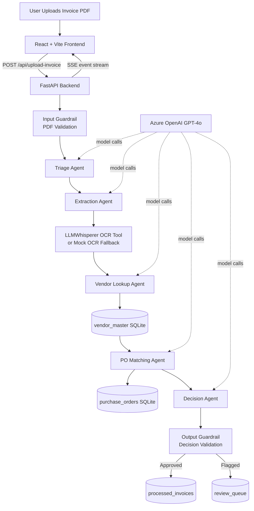

# AP Invoice Processing Agent

A full-stack agentic application demonstrating the **OpenAI Agents SDK** with a real-world AP (Accounts Payable) invoice processing workflow.

## What This Demonstrates

This app showcases all **4 core primitives** of the OpenAI Agents SDK:

| Primitive | Implementation |
|-----------|---------------|
| **Agents** | 5 specialized agents: Triage, Extraction, Vendor Lookup, PO Matching, Decision |
| **Handoffs** | Triage → Extraction → Vendor Lookup → PO Match → Decision |
| **Tools** | `@function_tool`: llmwhisperer_extract, vendor_lookup, po_lookup, approve_invoice, flag_for_review |
| **Guardrails** | `@input_guardrail` (PDF validation) + `@output_guardrail` (decision field validation) |

## Architecture



```
Invoice PDF uploaded
  → Triage Agent (validates, kicks off pipeline)
    → Extraction Agent (LLMWhisperer OCR → parse fields)
      → Vendor Lookup Agent (query vendor_master SQLite)
        → PO Matching Agent (query purchase_orders, calc variance)
          → Decision Agent:
              • variance < 5% + active vendor → auto-approve → approved_invoices
              • variance 5-10% / issues → flag_for_review → review_queue
              • vendor not found / variance > 10% → escalate (high priority)
```

## Tech Stack

| Layer | Tech |
|-------|------|
| Agentic Framework | `openai-agents` (Python) |
| LLM | Azure OpenAI GPT-4o via `AsyncAzureOpenAI` |
| OCR | LLMWhisperer API v2 |
| Database | SQLite |
| Backend | FastAPI + Uvicorn |
| Frontend | React + Vite + TypeScript + Tailwind CSS |
| Real-time | Server-Sent Events (SSE) for live agent step updates |

## Setup

### 1. Clone & Configure

```bash
cp .env.example .env
# Edit .env with your Azure OpenAI and LLMWhisperer credentials
```

### 2. Backend

```bash
cd backend

# Create virtual environment
python -m venv venv
source venv/bin/activate  # Windows: venv\Scripts\activate

# Install dependencies
pip install -r requirements.txt

# Initialize database + seed sample data
python -m database.init_db

# Generate sample PDF invoices
python generate_sample_invoices.py

# Start the API server
uvicorn main:app --reload --port 8000
```

### 3. Frontend

```bash
cd frontend
npm install
npm run dev
# Opens at http://localhost:5173
```

## Environment Variables

```env
# Azure OpenAI
AZURE_OPENAI_API_KEY=your_key
AZURE_OPENAI_ENDPOINT=https://your-resource.openai.azure.com/
AZURE_OPENAI_API_VERSION=2024-08-01-preview
AZURE_OPENAI_DEPLOYMENT=gpt-4o

# LLMWhisperer
LLMWHISPERER_API_KEY=your_key
LLMWHISPERER_BASE_URL=https://llmwhisperer-api.unstract.com/api/v2
```

> **No API keys?** The app still works! Without credentials, it uses mock OCR text (based on filename) so you can explore the full UI and agent logic.

## Sample Invoices

4 test PDFs in `sample_invoices/` covering all decision paths:

| File | Scenario | Expected Outcome |
|------|----------|-----------------|
| `invoice_001_acme_happy_path.pdf` | Acme, PO-2024-001, exact match ($2,450) | ✅ Auto-approved |
| `invoice_002_techcorp_amount_mismatch.pdf` | TechCorp, PO-2024-005, +19.6% over PO | ⚠️ Flagged for review |
| `invoice_003_newvendor_unknown.pdf` | NewVendor XYZ (not in master) | ⚠️ Flagged — unknown vendor |
| `invoice_004_global_logistics_no_po.pdf` | Global Logistics, no PO number | ⚠️ Flagged — missing PO |

## API Endpoints

| Method | Endpoint | Description |
|--------|----------|-------------|
| `POST` | `/api/upload-invoice` | Upload PDF → SSE stream of agent events |
| `POST` | `/api/upload-invoice-sync` | Upload PDF → wait for full result |
| `GET` | `/api/invoices` | List all processed invoices |
| `GET` | `/api/invoices/{id}` | Single invoice + agent trace |
| `GET` | `/api/review-queue` | Flagged invoices queue |
| `POST` | `/api/review-queue/{id}/resolve` | Human approves/rejects |
| `GET` | `/api/vendors` | Vendor master list |
| `GET` | `/api/purchase-orders` | PO list |
| `GET` | `/api/stats` | Dashboard stats |

## Key SDK Concepts in the Code

### Azure OpenAI Setup (`agents/setup.py`)
```python
client = AsyncAzureOpenAI(api_key=..., api_version=..., azure_endpoint=...)
set_default_openai_client(client)  # All agents use this automatically
```

### Agent with Tool + Handoff (`agents/extraction_agent.py`)
```python
Agent(
    name="Extraction Agent",
    model="gpt-4o",          # Azure deployment name
    tools=[llmwhisperer_extract],  # @function_tool
    handoffs=[vendor_agent],       # Next agent in chain
)
```

### Function Tool (`tools/vendor_lookup.py`)
```python
@function_tool
def vendor_lookup(vendor_name: str = "", vendor_id: str = "") -> str:
    """Docstring becomes the tool description for the LLM."""
    ...
```

### Input Guardrail (`guardrails/input_guardrail.py`)
```python
@input_guardrail
async def pdf_file_guardrail(ctx, agent, input) -> GuardrailFunctionOutput:
    # Check PDF magic bytes, return tripwire_triggered=True to block
    ...
```

### Runner (`agents/orchestrator.py`)
```python
# The agent loop: prompt → tool/handoff → result → reasoning → repeat
result = await Runner.run(triage_agent, input="Process invoice at: /path/to/file.pdf")

# Streaming for real-time UI updates
async for event in Runner.run_streamed(triage_agent, input=...).stream_events():
    ...
```
