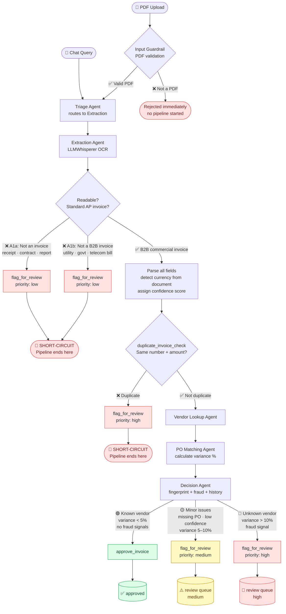

# AP Invoice Processing — Agentic AI

A full-stack agentic application built with the **OpenAI Agents SDK**, demonstrating a production-grade AP (Accounts Payable) invoice processing workflow. Five specialized agents collaborate via handoffs, tools, and guardrails to OCR, validate, and decide on invoices — with real-time streaming to a chat-style UI.

---

## Processing Paths

Every document submitted follows one of three paths depending on what the agents discover:



### Path Summary

| Path | Trigger | Outcome |
|------|---------|---------|
| 🟢 **Auto-Approved** | Known vendor · PO variance < 5% · No fraud signals | Stored as `approved` |
| 🟡 **Flagged — Review** | Missing PO · Low confidence · Variance 5–10% | `review_queue` medium priority |
| 🔴 **Flagged — Escalate** | Unknown vendor · Variance > 10% · Fraud signal | `review_queue` high priority |
| 🔴 **Short-Circuit A1a** | Not an invoice (receipt, contract, report…) | Extraction flags, pipeline stops |
| 🔴 **Short-Circuit A1b** | Not a B2B invoice (utility, govt, telecom bill…) | Extraction flags, pipeline stops |
| 🔴 **Short-Circuit A2** | Confirmed duplicate | Extraction flags, pipeline stops |
| 🔴 **Rejected at Gate** | File is not a valid PDF | Input guardrail blocks before any agent runs |

---

## Features

- **Chat interface** — upload invoices or ask questions about your AP pipeline from a single chat UI
- **Submitter notes** — optional context attached at upload time (e.g. "map to PO-2024-099", "pre-approved by CFO") passed directly into the agent prompt
- **Real-time streaming** — every agent step (handoff, tool call, tool result) streamed live via SSE
- **Smart short-circuit** — duplicate invoices and non-AP documents (utility bills, receipts, etc.) are stopped at Extraction; no unnecessary vendor/PO lookups
- **Currency detection** — agent reads currency from document context (Rs./₹ → INR, $ → USD, € → EUR, etc.); only defaults to USD if the document contains no currency indicator
- **Content fingerprinting** — SHA-256 hash of line items detects AI-manipulated resubmissions (same content, changed invoice number)
- **Behavioral fraud analysis** — 5 signals: velocity anomaly, billing cycle deviation, invoice splitting, just-below-threshold, round-number amounts
- **Contextual chat answers** — Triage Agent queries across all tables (invoices, vendors, POs, review queue) and synthesizes insights rather than dumping raw rows

---

## Agent Roles

```
┌─────────────────────────────────────────────────────────────────────┐
│ Triage Agent (entry point + query handler)                          │
│  TYPE 1 — PDF path in message → hand off to Extraction Agent        │
│  TYPE 2 — Query/question → invoice_query + vendor_history_context   │
│           synthesizes contextual AP insights directly               │
└──────────────────────────────┬──────────────────────────────────────┘
                               │ handoff (invoice files only)
┌──────────────────────────────▼──────────────────────────────────────┐
│ Extraction Agent                                                     │
│  • LLMWhisperer OCR API v2 (async polling)                          │
│  • Detects currency from document (symbols, ISO codes, context)     │
│  • Parses all fields: invoice #, dates, vendor, line items, totals  │
│  • Assigns confidence score 0.0–1.0                                 │
│  • Runs duplicate_invoice_check                                     │
│                                                                     │
│  OUTCOME A — TERMINAL (short-circuit, no handoff):                  │
│    A1a: Not an invoice at all → flag low + stop                     │
│    A1b: Not a B2B invoice (utility/govt/telecom) → flag low + stop  │
│    A2:  Confirmed duplicate → flag high + stop                      │
│  OUTCOME B — PIPELINE: valid B2B invoice → hand off to Vendor Agent │
└──────────────────────────────┬──────────────────────────────────────┘
                               │ handoff (valid invoices only)
┌──────────────────────────────▼──────────────────────────────────────┐
│ Vendor Lookup Agent                                                  │
│  • Fuzzy name match + tax ID lookup against vendor_master           │
│  • Returns: vendor_id, status, payment terms, risk, reviewer notes  │
└──────────────────────────────┬──────────────────────────────────────┘
                               │ handoff
┌──────────────────────────────▼──────────────────────────────────────┐
│ PO Matching Agent                                                    │
│  • Looks up PO by number or vendor                                  │
│  • Calculates variance %: (invoice_total − po_amount) / po_amount   │
│  • Returns: po_status, department, variance, match confidence       │
└──────────────────────────────┬──────────────────────────────────────┘
                               │ handoff
┌──────────────────────────────▼──────────────────────────────────────┐
│ Decision Agent (terminal — no further handoffs)                     │
│  • content_fingerprint_check: detects resubmissions with changed    │
│    invoice numbers (SHA-256 of normalized line items)               │
│  • invoice_fraud_analysis: 5 behavioral fraud signals               │
│  • vendor_history_context: behavioral intelligence per vendor       │
│  • Calls approve_invoice or flag_for_review based on all signals    │
└─────────────────────────────────────────────────────────────────────┘
```

---

## OpenAI Agents SDK — 4 Primitives

| Primitive | Implementation |
|-----------|---------------|
| **Agents** | 5 specialized agents, each with scoped instructions, model, and tools |
| **Handoffs** | `Triage → Extraction → Vendor → PO Match → Decision`; Extraction short-circuits on non-AP documents |
| **Tools** | 10 `@function_tool` decorated functions; agents decide when and how to call them |
| **Guardrails** | `@input_guardrail` blocks non-PDF files; `@output_guardrail` validates Decision Agent output fields |

---

## Tools Reference

| Tool | Agent | Description |
|------|-------|-------------|
| `llmwhisperer_extract` | Extraction | LLMWhisperer API v2 — submits PDF, polls `whisper-status`, retrieves `result_text` |
| `duplicate_invoice_check` | Extraction | Exact match on invoice number + amount + date against processed history |
| `vendor_lookup` | Vendor | Fuzzy name match + tax ID lookup against `vendor_master` |
| `po_lookup` | PO Match | PO lookup by number or vendor; calculates variance % |
| `content_fingerprint_check` | Decision | SHA-256 of normalized line items — catches resubmissions with changed invoice numbers |
| `invoice_fraud_analysis` | Decision | 5 behavioral signals from invoice history per vendor |
| `vendor_history_context` | Decision, Triage | Full vendor profile: approval rate, amount ranges, flag patterns, reviewer notes |
| `approve_invoice` | Decision | Writes to `processed_invoices` as approved; stores content fingerprint |
| `flag_for_review` | Extraction, Decision | Writes to `review_queue`; stores content fingerprint |
| `invoice_query` | Triage | Cross-table query (invoices + vendors + POs + review queue) for chat responses |

---

## Tech Stack

| Layer | Technology |
|-------|-----------|
| Agentic Framework | `openai-agents` SDK (Python) |
| LLM | Azure OpenAI GPT-4o via `AsyncAzureOpenAI` |
| OCR | LLMWhisperer API v2 (async job polling) |
| Database | SQLite — 5 tables: `vendor_master`, `purchase_orders`, `processed_invoices`, `review_queue`, `invoice_fingerprints` |
| Backend | FastAPI + Uvicorn, SSE streaming |
| Frontend | React + Vite + TypeScript + Tailwind CSS |
| Real-time | Server-Sent Events — each agent step streamed live to the UI |
| Observability | Langfuse v4 + OpenInference instrumentation — full agent trace per invoice run *(optional)* |

---

## Setup

### 1. Clone & Configure

```bash
git clone <repo-url>
cd ap-invoice-processing-openai-agent-sdk
cp .env.example .env
# Edit .env with your credentials
```

### 2. Backend

```bash
cd backend

python -m venv venv
source venv/bin/activate        # Windows: venv\Scripts\activate

pip install -r requirements.txt

# Initialize database and seed sample vendors + POs
python -m database.init_db

# Generate the 4 sample invoice PDFs
python generate_sample_invoices.py

# Start API server
uvicorn main:app --reload --port 8000
```

### 3. Frontend

```bash
cd frontend
npm install
npm run dev
# http://localhost:5173
```

### Docker (optional)

```bash
docker-compose up --build
# Backend: http://localhost:8000
# Frontend: http://localhost:5173
```

---

## Getting API Keys

### LLMWhisperer (OCR)

LLMWhisperer handles PDF → text extraction. The free tier gives you **100 pages/day**, forever — enough for development and testing.

1. Go to [unstract.com](https://unstract.com) and click **Try LLMWhisperer for free**
2. Create an account and log in
3. Copy your API key from the dashboard (it's called `unstract-key` in their API)
4. Pick the regional base URL closest to you:

   | Region | `LLMWHISPERER_BASE_URL` |
   |--------|------------------------|
   | US *(default)* | `https://llmwhisperer-api.us-central.unstract.com/api/v2` |
   | EU | `https://llmwhisperer-api.eu-west.unstract.com/api/v2` |

5. Check daily usage anytime:
   ```bash
   curl -H "unstract-key: YOUR_KEY" \
     https://llmwhisperer-api.us-central.unstract.com/api/v2/get-usage-info
   ```

> **No key yet?** The app falls back to mock OCR for the 4 bundled sample invoice filenames so you can explore the full pipeline without any setup. Any other file will be flagged as unreadable.

---

### Azure OpenAI

The agents use Azure OpenAI to run GPT-4o. If you are new to Azure, here is the quickest path:

1. **Create a free Azure account** at [azure.microsoft.com/free](https://azure.microsoft.com/free) — includes $200 credit for 30 days
2. In the Azure portal, search for **Azure OpenAI** and create a resource (choose a region where GPT-4o is available — `East US`, `West US`, `Sweden Central`, `UK South` are reliable choices)
3. Once the resource is created, open **Azure OpenAI Studio → Deployments → Create deployment**
4. Deploy a model and note the **deployment name** you choose (this is `AZURE_OPENAI_DEPLOYMENT`)
5. Back in the Azure portal, go to your resource → **Keys and Endpoint** to get the key and endpoint URL

**Compatible models** — any of these work with the app:

| Model | Notes |
|-------|-------|
| `gpt-4o` | Recommended — best reasoning for multi-step agent decisions |
| `gpt-4o-mini` | Faster and cheaper; works well for most invoices |
| `gpt-4-turbo` | Previous generation; works but gpt-4o is preferred |

Set `AZURE_OPENAI_DEPLOYMENT` to whatever deployment name you chose in step 4.

> **Prefer standard OpenAI?** Swap `AsyncAzureOpenAI` for `AsyncOpenAI` in `backend/app_agents/setup.py` and set `OPENAI_API_KEY` instead. The rest of the app is model-agnostic.

---

### Langfuse *(optional — observability)*

Langfuse gives you a full trace dashboard for every invoice run: which agents ran, what tools were called, what the LLM decided at each step, token usage, latency, and errors. Free tier is **50K observations/month**.

1. Sign up at [langfuse.com](https://langfuse.com) (or [cloud.langfuse.com](https://cloud.langfuse.com))
2. Create a project → copy the **Public Key** and **Secret Key**
3. Add them to your `.env` (see below) — the app activates tracing automatically on next start
4. Open your Langfuse project dashboard to see traces appear in real time as invoices are processed

Pick the host closest to you:

| Region | `LANGFUSE_BASE_URL` |
|--------|---------------------|
| EU *(default)* | `https://cloud.langfuse.com` |
| US | `https://us.cloud.langfuse.com` |
| Self-hosted | your own URL |

> Langfuse is fully **optional** — the app runs identically without it. If keys are missing, observability is silently skipped.

> **Important:** The backend must be started with the virtualenv **activated** (`source venv/bin/activate`) for Langfuse to load. If you start uvicorn without activating the venv, the `langfuse` package won't be found even if it's installed. Verify setup by hitting `GET /api/debug/observability` after starting the server.

---

### `.env` file

```env
# Azure OpenAI
AZURE_OPENAI_API_KEY=your_key_from_azure_portal
AZURE_OPENAI_ENDPOINT=https://your-resource-name.openai.azure.com/
AZURE_OPENAI_API_VERSION=2025-03-01-preview
AZURE_OPENAI_DEPLOYMENT=gpt-4o          # your deployment name

# LLMWhisperer OCR
LLMWHISPERER_API_KEY=your_unstract_key
LLMWHISPERER_BASE_URL=https://llmwhisperer-api.us-central.unstract.com/api/v2

# Langfuse observability (optional)
LANGFUSE_PUBLIC_KEY=pk-lf-...
LANGFUSE_SECRET_KEY=sk-lf-...
LANGFUSE_BASE_URL=https://cloud.langfuse.com

# App (defaults shown — change if needed)
SQLITE_DB_PATH=./ap_invoices.db
UPLOAD_DIR=./uploads
```

---

## Sample Invoices

Four test PDFs in `sample_invoices/` — one per decision path:

| File | Vendor | Scenario | Expected Outcome |
|------|--------|----------|-----------------|
| `invoice_001_acme_happy_path.pdf` | Acme Office Supplies | PO match, 0% variance | ✅ Auto-approved |
| `invoice_002_techcorp_amount_mismatch.pdf` | TechCorp Solutions | +19.6% over PO amount | ⚠️ Flagged — amount mismatch |
| `invoice_003_newvendor_unknown.pdf` | NewVendor XYZ Corp | Vendor not in master | 🚨 Flagged — unknown vendor |
| `invoice_004_global_logistics_no_po.pdf` | Global Logistics Inc. | No PO number on invoice | ⚠️ Flagged — missing PO |

### Uploading with Submitter Notes

When uploading, an optional notes field appears before processing starts. Useful for exception cases:

| Scenario | Example note |
|----------|-------------|
| Invoice has no PO number | `Map to PO-2024-099` |
| New vendor not yet onboarded | `New vendor, procurement approved onboarding` |
| Amount exceeds PO | `Rush delivery surcharge pre-approved by CFO` |
| Replacing an errored invoice | `Replaces INV-2024-XXX which had wrong tax ID` |

Notes are appended to the agent prompt as `Submitter notes: …` and are visible to all agents in the pipeline.

---

## API Endpoints

| Method | Endpoint | Description |
|--------|----------|-------------|
| `POST` | `/api/upload-invoice` | Upload PDF + optional `notes` form field → SSE stream |
| `POST` | `/api/upload-invoice-sync` | Upload PDF → wait for full result (no streaming) |
| `POST` | `/api/chat` | Text query → SSE stream (Triage Agent answers directly) |
| `GET` | `/api/invoices` | All processed invoices |
| `GET` | `/api/invoices/{id}` | Single invoice + full agent trace |
| `GET` | `/api/review-queue` | Flagged invoices pending human review |
| `POST` | `/api/review-queue/{id}/resolve` | Human approves or rejects a flagged invoice |
| `GET` | `/api/vendors` | Vendor master list |
| `GET` | `/api/vendors/{id}/history` | Full behavioral history for a vendor |
| `GET` | `/api/purchase-orders` | Purchase order list |
| `GET` | `/api/stats` | Aggregate stats |
| `GET` | `/api/logs` | Recent Langfuse traces (returns empty list if not configured) |
| `GET` | `/api/health` | Health check |
| `GET` | `/api/debug/observability` | Observability setup status — useful for diagnosing Langfuse config issues |

---

## Database Schema

```
processed_invoices              review_queue
──────────────────              ────────────
id                              id
invoice_number                  invoice_id → processed_invoices
vendor_name                     reason
total_amount                    priority  (low / medium / high)
currency                        status    (pending / resolved)
status                          resolved_by
confidence_score                resolution_notes
decision_reason                 created_at
pipeline_response
agent_trace (JSON)
created_at

vendor_master                   purchase_orders
─────────────                   ───────────────
vendor_id                       po_number
vendor_name                     vendor_id → vendor_master
tax_id                          amount
payment_terms                   department
risk_level                      status
status                          created_at
reviewer_notes

invoice_fingerprints
────────────────────
id
invoice_id → processed_invoices
line_items_hash   SHA-256 of normalized line items
content_hash      SHA-256 of full invoice content
created_at
```

---

## Project Structure

```
.
├── backend/
│   ├── app_agents/
│   │   ├── triage_agent.py          # Entry point + chat query handler
│   │   ├── extraction_agent.py      # OCR + parsing + short-circuit logic
│   │   ├── vendor_agent.py          # Vendor master lookup
│   │   ├── po_match_agent.py        # PO matching + variance calculation
│   │   ├── decision_agent.py        # Final approval / flag decision
│   │   ├── orchestrator.py          # Pipeline wiring + SSE streaming
│   │   └── setup.py                 # Azure OpenAI client configuration
│   ├── tools/
│   │   ├── llmwhisperer_tool.py     # LLMWhisperer v2 OCR (async polling)
│   │   ├── duplicate_invoice_check.py
│   │   ├── content_fingerprint_check.py
│   │   ├── invoice_fraud_analysis.py
│   │   ├── vendor_lookup.py
│   │   ├── vendor_history_context.py
│   │   ├── po_lookup.py
│   │   ├── invoice_query.py         # Cross-table rich query for Triage chat
│   │   ├── approve_invoice.py
│   │   └── flag_for_review.py
│   ├── guardrails/
│   │   ├── input_guardrail.py       # PDF magic-byte validation
│   │   └── output_guardrail.py      # Decision field validation
│   ├── database/
│   │   ├── init_db.py               # Schema creation + seed data + migrations
│   │   ├── queries.py               # All DB read/write operations
│   │   └── models.py                # Pydantic request/response models
│   ├── main.py                      # FastAPI app + all endpoints
│   ├── config.py                    # Settings loaded from .env
│   ├── observability.py             # Langfuse v4 + OpenInference setup (optional)
│   ├── Dockerfile
│   └── requirements.txt
├── frontend/
│   └── src/
│       ├── components/
│       │   ├── Dashboard.tsx        # Chat interface + file upload + submitter notes
│       │   ├── Logs.tsx             # Langfuse trace viewer (Pipeline Logs tab)
│       │   ├── About.tsx            # SDK primitives + pipeline architecture
│       │   ├── InvoiceList.tsx      # Processed invoices table
│       │   ├── ReviewQueue.tsx      # Flagged invoices + human resolution
│       │   ├── VendorsAndPOs.tsx    # Vendor master + PO reference data
│       │   └── StatsOverview.tsx    # Stats cards + flag reason breakdown
│       ├── api/client.ts            # API helpers + SSE stream reader
│       └── App.tsx                  # Nav, routing, live sidebar stats
├── sample_invoices/                 # 4 test PDFs covering all decision paths
├── docker-compose.yml
├── .env.example
└── .gitignore
```

---

## SSE Event Stream

When a PDF is uploaded or a chat message is sent, the backend streams JSON events as each agent step completes. The frontend renders these in real time.

**Invoice pipeline (happy path):**
```
{"event": "upload_complete",  "filename": "invoice_001_acme.pdf"}
{"event": "handoff",          "from_agent": "Triage Agent",      "to_agent": "Extraction Agent"}
{"event": "tool_call",        "agent": "Extraction Agent",       "tool": "llmwhisperer_extract"}
{"event": "tool_result",      "agent": "Extraction Agent",       "output": "INVOICE\nAcme Office..."}
{"event": "tool_call",        "agent": "Extraction Agent",       "tool": "duplicate_invoice_check"}
{"event": "handoff",          "from_agent": "Extraction Agent",  "to_agent": "Vendor Lookup Agent"}
{"event": "tool_call",        "agent": "Vendor Lookup Agent",    "tool": "vendor_lookup"}
{"event": "handoff",          "from_agent": "Vendor Lookup Agent","to_agent": "PO Matching Agent"}
{"event": "tool_call",        "agent": "PO Matching Agent",      "tool": "po_lookup"}
{"event": "handoff",          "from_agent": "PO Matching Agent", "to_agent": "Decision Agent"}
{"event": "tool_call",        "agent": "Decision Agent",         "tool": "approve_invoice"}
{"event": "pipeline_complete","final_output": "Invoice INV-2024-0891 approved..."}
```

**Short-circuit (utility bill / not an AP invoice):**
```
{"event": "handoff",          "from_agent": "Triage Agent",     "to_agent": "Extraction Agent"}
{"event": "tool_call",        "agent": "Extraction Agent",      "tool": "llmwhisperer_extract"}
{"event": "tool_call",        "agent": "Extraction Agent",      "tool": "flag_for_review"}
{"event": "pipeline_complete","final_output": "Flagged: Not a standard AP invoice — utility bill"}
```
